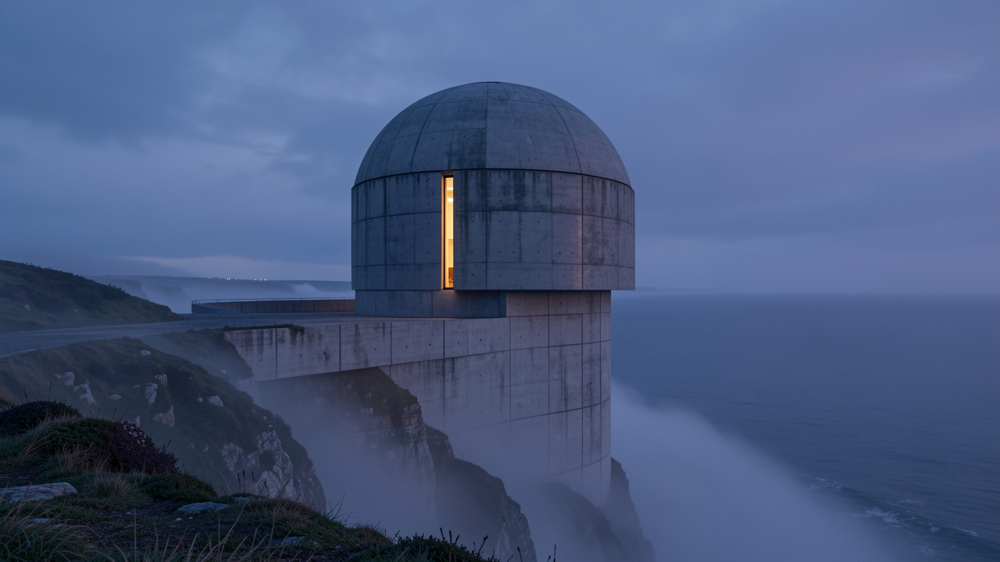

# Cloudflare Image Generation API for Claude Code

[](LICENSE)
[](https://code.claude.com/docs/en/plugins)
[](https://developers.cloudflare.com/workers-ai/)
[](https://www.python.org/)
[](#)
[](#contributing)
[](https://github.com/ErbaZZ/cf-image-gen/stargazers)
[](https://github.com/ErbaZZ/cf-image-gen/commits)

A self-hosted, free-tier image generation pipeline for Claude Code. A private Cloudflare Workers AI proxy plus an installable Claude Code plugin. Supports Flux 1 Schnell, Flux 2 (Klein 4B / 9B / dev), Leonardo Lucid Origin, and Leonardo Phoenix. Works on Cloudflare's free plan - no billing, no per-image fees on the free tier.

## Features

- Free tier covers light use. Cloudflare Workers (100k requests/day) plus Workers AI Neuron allotment. No billing required.
- Six allowlisted image models: Flux 1 Schnell, Flux 2 Klein 4B/9B, Flux 2 dev, Leonardo Lucid Origin, Leonardo Phoenix. Switch per request.
- Bearer-token auth. Your worker, your key, your quota.
- Claude Code plugin. Installable via `/plugin marketplace add`. Picks up "generate an image" prompts automatically.
- Cross-platform Python 3.8+, stdlib only. Runs on macOS, Linux, Windows (PowerShell or WSL).
- Six worked sample prompts and one generated image per model. Doubles as a smoke test.
- Parallel generation. Claude fires multiple Bash calls in one message for batch variants.

## Three pieces, one repo

1. **`worker/`**: a tiny Cloudflare Worker that proxies Workers AI image-gen models behind a bearer token. Free plan covers it.
2. **`skills/cf-image-gen/`**: a Claude Code skill that wraps the worker so Claude can invoke image generation from any session. Cross-platform Python (no bash required). Packaged as an installable plugin via `.claude-plugin/`.
3. **`examples/`**: six showcase prompts and six generated reference images (one per allowlisted model) to verify the pipeline end-to-end.

Built because Google's Imagen / Gemini image APIs require billing even on the free tier, and Cloudflare Workers AI doesn't.

## Table of Contents

- [Features](#features)
- [Quickstart](#quickstart)
- [Part 1: Deploy the Cloudflare Worker](#part-1-deploy-the-cloudflare-worker)
- [Part 2: Install the Claude Code plugin](#part-2-install-the-claude-code-plugin)
- [Part 3: Writing useful prompts](#part-3-writing-useful-prompts)
- [Sample images by model](#showcase)
- [How the worker works](#how-the-worker-works)
- [How the skill works](#how-the-skill-works)
- [Cost](#cost)
- [Troubleshooting](#troubleshooting)
- [FAQ](#faq)
- [Credits](#credits--inspiration)
- [Contributing](#contributing)

## Quickstart

```bash
# 1. Deploy the worker (5 min)
cd worker && wrangler login && wrangler secret put API_KEY && wrangler deploy

# 2. Install the Claude Code plugin
claude plugin marketplace add ErbaZZ/cf-image-gen
claude plugin install cf-image-gen@cf-image-gen

# 3. Configure env vars in ~/.claude/settings.json (CF_IMAGE_URL + CF_IMAGE_API_KEY)
# 4. Generate from any session: "generate a 1024x1024 hero image of X"
```

---

## What you'll have after following this

- A private endpoint at `https://your-name.workers.dev/` you can POST to with a prompt and get back a JPEG.
- A `/cf-image-gen` skill installed in Claude Code that you can invoke with natural language: *"generate three hero images for a product launch."*
- Six showcase prompts (one per model) you can copy, riff on, or use to smoke-test a fresh deploy.

---

## Part 1: Deploy the Cloudflare Worker

Two paths - pick one. Both produce the same worker.

### Prerequisites

- A free Cloudflare account ([sign up](https://dash.cloudflare.com/sign-up)).
- Workers AI enabled on your account (one-click at [Workers AI dashboard](https://dash.cloudflare.com/?to=/:account/ai)).
- An API key - generate one yourself: `openssl rand -base64 32 | tr -d '=+/' | head -c 48`. Save it; the worker rejects any request without a matching bearer token.

### Path A: Wrangler CLI (recommended for devs)

Requires Node.js + npm/pnpm.

```bash
# Install wrangler if you don't have it.
npm install -g wrangler   # or: pnpm add -g wrangler

cd worker/

# Authenticate wrangler with your Cloudflare account.
wrangler login

# Push the bearer-token secret. Paste your API key when prompted.
wrangler secret put API_KEY

# Deploy.
wrangler deploy
```

Wrangler prints a URL like `https://cf-image-gen.your-handle.workers.dev/`. Save both the URL and the API key - you'll need them for the skill.

### Path B: Cloudflare dashboard (no CLI, no Node.js)

Use this if you don't want to install Node/wrangler, or you're on a locked-down machine.

1. **Open the Workers dashboard.** Go to [dash.cloudflare.com](https://dash.cloudflare.com) → **Workers & Pages** → **Create application** → **Create Worker**.
2. **Name the worker.** Use anything (e.g. `cf-image-gen`). Click **Deploy** to create the placeholder.
3. **Replace the code.** On the worker's page, click **Edit code**. Delete the placeholder. Paste the entire contents of [`worker/worker.js`](worker/worker.js) from this repo. Click **Save and Deploy**.
4. **Add the Workers AI binding.** Back on the worker's page → **Settings** → **Bindings** → **Add binding** → **Workers AI**. Variable name: `AI`. Save.
5. **Add the bearer-token secret.** Same Bindings page → **Add binding** → **Secret**. Variable name: `API_KEY`. Value: the secret you generated in Prerequisites. Save.
6. **Redeploy.** Settings save automatically, but trigger a fresh deploy via **Deployments** → **Deploy** to pick up the bindings.
7. **Copy your URL.** The worker page shows it at the top, like `https://cf-image-gen.your-handle.workers.dev/`. Save it alongside the API key.

That's it - same endpoint as Path A, just clicked instead of typed.

### Verify

```bash
curl -X POST https://YOUR-WORKER-URL/ \
  -H "Authorization: Bearer YOUR_API_KEY" \
  -H "Content-Type: application/json" \
  -d '{"prompt":"a chrome cube on a navy background"}' \
  -o test.jpg

open test.jpg   # macOS - or just check the file
```

You should see a JPEG of a chrome cube. If you get HTTP 401, the bearer token is wrong. If you get 500, check `wrangler tail` for the model error.

### Models available

The worker allowlists six models. Default = `@cf/black-forest-labs/flux-1-schnell` (fastest, cheapest, free-tier-friendly).

| Model ID | Best for | Cost (free tier covers light use) |
|---|---|---|
| `@cf/black-forest-labs/flux-1-schnell` | **Default.** Speed, iterations. | ~$0.0001/step |
| `@cf/black-forest-labs/flux-2-klein-4b` | Quality bump, still cheap. | ~$0.0003 per output 512² tile |
| `@cf/black-forest-labs/flux-2-klein-9b` | Top-tier Flux 2 quality. | $0.015 per first MP |
| `@cf/black-forest-labs/flux-2-dev` | Step-tunable Flux 2. | Bills per-step in+out |
| `@cf/leonardo/lucid-origin` | Photoreal, cinematic. | $0.007 per 512² tile |
| `@cf/leonardo/phoenix-1.0` | Illustration, stylized. | $0.0058 per 512² tile |

Pass `model` in the request body to override the default. Full pricing reference: [Cloudflare Workers AI: Image Model Pricing](https://developers.cloudflare.com/workers-ai/platform/pricing/#image-model-pricing).

### Customizing the allowlist

Edit `worker/worker.js` - the `ALLOWED_MODELS` Set and `DEFAULT_MODEL` const are at the top of the file. Then redeploy:

- **Wrangler:** `wrangler deploy`
- **Dashboard:** open the worker → **Edit code** → paste the updated `worker.js` → **Save and Deploy**.

---

## Part 2: Install the Claude Code plugin

The repo ships as a Claude Code plugin via its own marketplace. Three install options:

### Option A: Marketplace install (recommended)

In any Claude Code session:

```
/plugin marketplace add ErbaZZ/cf-image-gen
/plugin install cf-image-gen@cf-image-gen
```

Updates are pulled automatically when the marketplace refreshes.

### Option B: Local clone + `--plugin-dir` (development)

```bash
git clone https://github.com/ErbaZZ/cf-image-gen ~/code/cf-image-gen
claude --plugin-dir ~/code/cf-image-gen
```

Edits to `skills/cf-image-gen/SKILL.md` or `skills/cf-image-gen/scripts/generate.py` take effect on `/reload-plugins`.

### Option C: Symlink as a standalone skill (no plugin manager)

```bash
git clone https://github.com/ErbaZZ/cf-image-gen ~/code/cf-image-gen
ln -s ~/code/cf-image-gen/skills/cf-image-gen ~/.claude/skills/cf-image-gen
```

Uses Claude Code's standalone-skill loader (`~/.claude/skills/`). No namespacing - invoked as `/cf-image-gen` instead of `/cf-image-gen:cf-image-gen`. If the script path doesn't resolve, replace `${CLAUDE_PLUGIN_ROOT}` in SKILL.md with the absolute path to the cloned repo.

### Configure env vars

Edit `~/.claude/settings.json` and add two entries under `env`:

```json
{
  "env": {
    "CF_IMAGE_URL": "https://YOUR-WORKER-URL/",
    "CF_IMAGE_API_KEY": "YOUR_API_KEY"
  }
}
```

Restart Claude Code (or start a fresh session). Verify in any session:

```
> can you check if cf-image-gen is wired up?
```

Claude should list the skill among available skills and confirm the env vars are set.

### Test from Claude Code

```
> generate a 1024x1024 image of a chrome cube on a navy background and save it to /tmp/test.jpg
```

Claude should invoke the skill, hit your worker, and save the JPEG. If anything fails, the skill's error messages point at the cause (401 = bad key, 400 = bad model/prompt, 500 = worker exception → check `wrangler tail`).

---

## Part 3: Writing useful prompts

The workflow this repo enables:

```
brief  →  prompt  →  generated image  →  pick + ship
```

### Build a prompt template (one-time, optional but recommended)

A *prompt template* is a structured "system prompt" you hand Claude that locks in a consistent look. For brand work, define it once and reference it on every generation.

Sections to include:

1. **Persona**: who Claude is acting as (e.g. "creative director for an architectural studio").
2. **Core metaphors**: how each common concept maps to a visual idea in your aesthetic.
3. **Aesthetic anchor words**: phrases that nudge the model in your direction (e.g. *"editorial product photography, soft directional studio key"*).
4. **Strict palette**: exact hex codes, plus a hard exclusion list of off-palette colors.
5. **Composition modes**: when to use a hero shot vs an editorial flat lay vs a macro close-up.
6. **Negative prompts**: the boilerplate "no people, no text, no [unwanted tropes]" string you'll append to every prompt.
7. **One worked example**: a sample input + output prompt so Claude has a concrete pattern to mimic.

Save as markdown in your project. Reference it whenever you want a new image.

### Generate

In Claude Code:

```
> Generate three 1024x1024 hero image variants for [topic], saved to ./out/.
```

(If you have a template: `> Use the brand template at ./brand-template.md and generate three…`)

Claude will:
1. Read any referenced template.
2. Build three prompts.
3. Invoke the `cf-image-gen` skill in parallel.
4. Return the file paths.

Reroll any that don't land. Lock the good ones with `--seed` for reproducibility.

### Showcase

<a id="showcase"></a>
`examples/prompts/showcase-prompts.md` pairs six generic prompts with the six allowlisted models. The generated images live in `examples/sample_images/` - one per model - and double as a compatibility smoke-test for the worker.

| `flux-1-schnell` | `flux-2-klein-4b` | `flux-2-klein-9b` |
|---|---|---|
|  |  |  |
| **`flux-2-dev`** | **`leonardo/lucid-origin`** | **`leonardo/phoenix-1.0`** |
|  |  |  |

---

## How the worker works

`worker/worker.js` is ~60 lines. Three things happen on every request:

1. **Auth check**: reject anything without `Authorization: Bearer ${API_KEY}`.
2. **Validate**: accept only `POST /`, require `prompt` in body, allowlist `model`.
3. **Proxy**: call `env.AI.run(model, { prompt, ...rest })` and return the result as `image/jpeg`.

The one nuance: Flux models return base64-wrapped JSON (`{ image: "<base64>" }`), other models return raw bytes. `normalizeImage()` handles both. Caller always gets a clean JPEG.

Add fields like `num_steps`, `width`, `height`, `seed`, `guidance` to the request body - they're forwarded to the model via the `...rest` spread.

---

## How the skill works

`skills/cf-image-gen/SKILL.md` declares the trigger phrases and documents the model menu. `skills/cf-image-gen/scripts/generate.py` is the actual implementation - a Python wrapper (stdlib only: `urllib`, `json`, `argparse`) that:

1. Verifies `CF_IMAGE_URL` and `CF_IMAGE_API_KEY` are set.
2. Builds a JSON payload from the CLI flags.
3. POSTs to the worker.
4. Saves the response as a JPEG (or surfaces the error if HTTP ≠ 2xx).

Cross-platform - macOS, Linux, Windows (PowerShell or WSL). Requires Python 3.8+, no third-party packages.

Claude invokes the script via the Bash tool. The skill description ("Use when the user asks to 'generate an image'…") is what makes Claude reach for it automatically.

---

## Cost

For light use, **everything in this repo runs on free plans:**

- Cloudflare Workers: 100k requests/day free.
- Workers AI: free tier includes daily Neuron allotment. Flux Schnell ≈ 10 Neurons/image, so you can generate ~thousands/day free.
- Claude Code: skill execution is local - only the model calls cost.

If you scale into paid territory, the heaviest model (`flux-2-klein-9b` at $0.015 per first MP) is still ~50× cheaper than DALL·E 3 or Midjourney for equivalent quality.

---

## Troubleshooting

| Symptom | Cause | Fix |
|---|---|---|
| HTTP 401 from worker | Wrong bearer token | Re-run `wrangler secret put API_KEY` |
| HTTP 400 "Invalid model" | Model not in allowlist | Use one of the 6 listed, or edit worker |
| HTTP 500 "Failed to generate image" | Model API rejected payload | `wrangler tail` for the real error |
| Skill not auto-invoking | Description trigger phrases didn't match | Type `/cf-image-gen` to invoke directly |
| `CF_IMAGE_URL not set` | Env vars not in settings.json | Add to `~/.claude/settings.json` under `env`, restart session |
| Generated image is off-style | Prompt too loose | Reference a brand template; include strict palette + negative prompts |
| HTTP 403 "error code: 1010" | Cloudflare bot-protection blocking default User-Agent | `generate.py` sets a custom UA; if calling from another client, set `User-Agent` header |
| Flux 2 model returns 500 "multipart" | Worker built without Flux 2 multipart branch | Pull latest worker.js (includes `buildMultipart`), redeploy |

---

## FAQ

### Is this really free?

For light use - yes. Cloudflare Workers gives you 100,000 requests per day on the free plan. Workers AI bundles a daily Neuron allotment; Flux 1 Schnell at default settings costs about 10 Neurons per image, so you can generate ~1,000 images/day without paying anything. Heavier models (Flux 2 Klein 9B, Leonardo Lucid Origin) eat the allotment faster but still cost cents, not dollars.

### How does this compare to DALL·E, Midjourney, or Stable Diffusion?

- **DALL·E 3 / GPT Image**: requires OpenAI billing, no free tier.
- **Midjourney**: Discord-only, $10/mo minimum, no API.
- **Stable Diffusion** (self-hosted) - needs a GPU; cloud hosting costs more than CF Workers AI per image.
- **Google Imagen / Gemini image**: requires GCP billing even on the trial.
- **Cloudflare Workers AI (this repo)**: free tier covers thousands of images per day, no billing required, programmable API.

For equivalent output quality, Workers AI's heaviest model (`flux-2-klein-9b` at $0.015 per first megapixel) is roughly **50× cheaper than DALL·E 3 or Midjourney**.

### Can I use this without Claude Code?

Yes - the Cloudflare Worker is just an HTTP endpoint. Curl it, fetch it from a Next.js route handler, call it from a Python script, whatever. The Claude Code plugin is one client; the worker is the actual generation API.

### Does it support image-to-image (img2img) or inpainting?

Not yet. Workers AI exposes `stable-diffusion-v1-5-img2img` and inpainting endpoints - adding them needs a worker patch (multipart body handling). PRs welcome. See [Contributing](#contributing).

### Which model should I use?

- **Drafts and iteration** → `flux-1-schnell` (fastest, cheapest, 4 steps).
- **Final hero images** → `flux-2-klein-9b` (top Flux 2 quality) or `flux-2-dev` (step-tunable).
- **Photorealism** → `leonardo/lucid-origin`.
- **Painterly illustration** → `leonardo/phoenix-1.0`.

See the [Showcase](#showcase) for a visual comparison.

### Can I add models to the allowlist?

Yes. Edit `worker/worker.js` - the `ALLOWED_MODELS` Set is at the top. Run `wrangler deploy` to push. Note that the **Flux 2 family requires multipart input**: the worker already branches on this; if you add another multipart-only model, extend `buildMultipart()`.

### Why a private worker instead of calling Workers AI directly?

Workers AI's `env.AI` binding is Worker-internal - there is no public REST endpoint you can hit from outside Cloudflare. The proxy worker exposes it as a bearer-token-protected HTTP API so any client (Claude Code, your laptop, a Lambda, a phone) can use it.

### What about rate limits?

The free tier resets daily at UTC midnight. If you hit the cap mid-generation you'll see `HTTP 500` with `details: "4006: you have used up your daily free allocation..."`. Either wait, upgrade Workers Paid ($5/mo), or tune `--steps` down to stretch the allotment.

### Is the worker safe to expose publicly?

Yes, as long as your bearer token is long and random. Generate with `openssl rand -base64 32`. The worker rejects anything without a matching `Authorization: Bearer ...` header. No prompt injection risk on the auth path because the token is checked before any input is parsed.

---

## Credits & inspiration

The worker design was inspired by [`saurav-z/free-image-generation-api`](https://github.com/saurav-z/free-image-generation-api), which demonstrates the same Cloudflare-Workers-AI-as-image-proxy pattern. This repo extends that idea with model selection, an allowlist, base64-JSON normalisation across Flux/non-Flux models, and a Claude Code skill that wraps the API end-to-end.

## License

MIT. See `LICENSE`.

## Contributing

PRs welcome. Particularly useful additions:

- Reference-image (img2img) support - Workers AI's `stable-diffusion-v1-5-img2img` accepts a reference image as base64.
- A web UI for the worker so non-technical users can generate without Claude Code.
